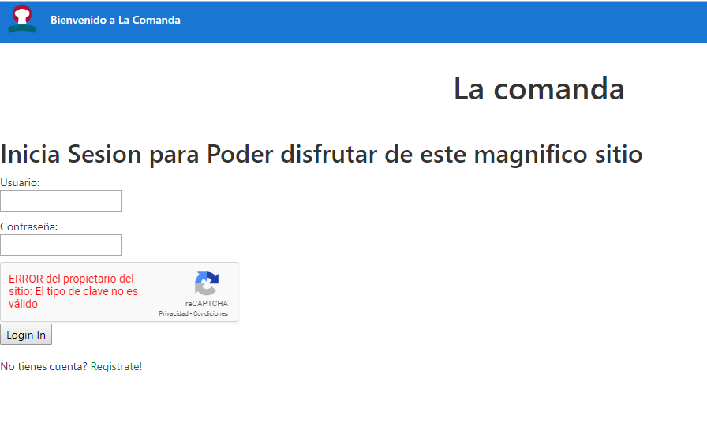
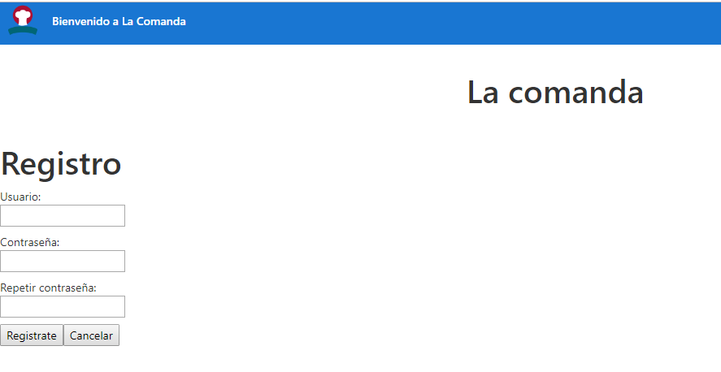
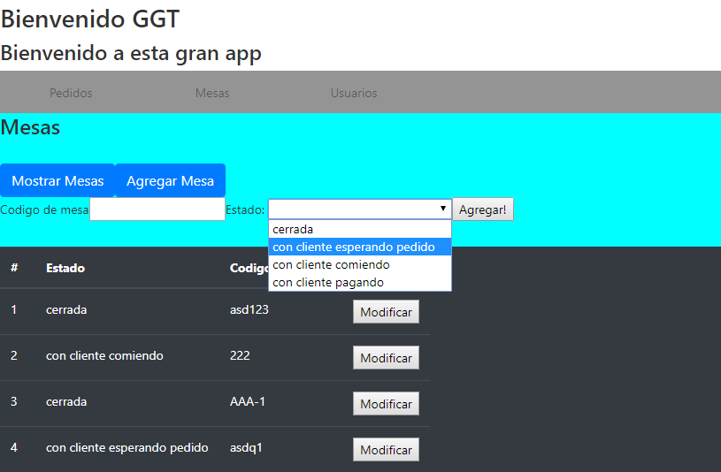

# LaComanda By GGT 
# ingresa a este sitio en desarrollo <a href="https://trittog.github.io/TP_Lab4_2c_2019/">Aqui</a>

#Login:

El login cuenta con coneccion a la api, la cual retorna un token valido dependiendo que tipo de usuario es el que ingresa con un captcha verificador.

#Registro:

El registro es muy sencillo, se conecta a la api guardando un nuevo usuario, al poder acceder cualquiera al registro, este guardara automaticamente al usuario ingresado como "cliente", si se quiere agregar otro tipo de usuario, debera hacerlo el administrador o "socio" una vez ingresado desde la pantalla principal

#Pantalla Principal -Seccion Mesas-

Esta es la pantalla principal, en la misma aparece el nombre de usuario que se acaba de logear. Tambien tiene 3 secciones: Pedidos, Mesas y usuarios (no descarto quitar o agregar secciones en un futuro) la seccion mesas muetra las mesas con su respectivo codigo y estado, los cuales pueden ser modificados mediante un boton. solo el administrador o "socio" podra crear una mesa nueva, pero el boton esta disponible para todos, (debo correjir eso)

#Pantalla Principal -Seccion Pedidos-

En desarrollo... PROXIMAMENTE

#Pantalla Principal -Seccion Usuarios-

esta muestra los usuarios creados, (solo debe ser vista por los admins o "socios") ademas permite cargar un usuario nuevo que puede ser: "socio", "cocinero", "mozo", etc, (solo los socios)

